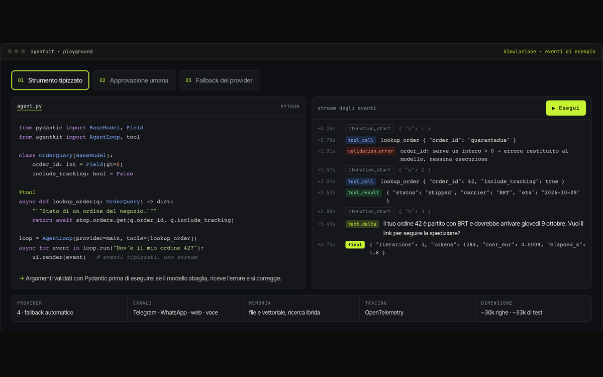

# Agentkit

> La base comune di tutti i miei assistenti AI: un motore piccolo e tipizzato, riutilizzato in ogni progetto.

`05` · **Libreria Python personale** · 2026 · Autore e manutentore

[**▶ Prova la demo**](https://portfolio.lele-tradevalue.com/progetti/agentkit/#demo) · [Caso studio completo](https://portfolio.lele-tradevalue.com/progetti/agentkit/) · [English version](https://portfolio.lele-tradevalue.com/en/progetti/agentkit/)

## Il problema

Ogni progetto con un assistente AI ripete gli stessi pezzi: il ciclo che parla con il modello, gli strumenti, lo streaming, la memoria, i canali come Telegram. Riscriverli ogni volta vuol dire bug diversi in ogni progetto e nessun miglioramento condiviso.

## Cosa ho costruito

Ho raccolto quei pezzi in Agentkit, la libreria che oggi alimenta l’e-commerce, AURIGA, RECALL, Splitro e gli altri assistenti. Un unico ciclo di esecuzione con strumenti scritti in Python e validati con Pydantic, eventi tipizzati per lo streaming, approvazione umana sulle azioni sensibili, passaggio automatico a un altro provider se il primo fallisce, memoria, adattatori per Telegram e WhatsApp, voce in tempo reale e tracciamento.

## Come funziona

1. **Strumenti tipizzati** — Una funzione Python con argomenti annotati diventa uno strumento con schema rigoroso.
2. **Un ciclo, tanti canali** — Lo stesso agente risponde da web, terminale, Telegram, WhatsApp o voce.
3. **Controllo umano** — Ogni chiamata può essere approvata, rifiutata o corretta prima di partire.
4. **Affidabilità** — Se un provider cade, il ciclo passa al successivo senza perdere la conversazione.

## Perché funziona

- **Usata ovunque.** Ogni miglioramento arriva a tutti i progetti con un aggiornamento di versione.
- **Più test che codice.** Circa 33 mila righe di test per circa 30 mila di libreria.
- **Indipendente dal provider.** Cambiare modello è una riga di configurazione, non una riscrittura.
- **Eventi, non stringhe.** Interfacce e log ricevono eventi tipizzati: facili da mostrare e da verificare.

## In numeri

| | |
|---:|---|
| **~30k** | righe di libreria |
| **~33k** | righe di test |
| **5+** | progetti che la usano |
| **4** | canali: web, Telegram, WhatsApp, voce |

## Stack

`Python` `Pydantic` `asyncio` `FastAPI` `MCP` `OpenTelemetry`

## Cosa resta privato

Il codice della libreria è privato; il playground riproduce il flusso degli eventi con esempi. Questo repository contiene solo la presentazione del progetto: niente codice sorgente, cronologia o configurazioni.

<b>In English</b>

**Agentkit** — The shared foundation of all my AI assistants: a small, typed engine reused in every project.

I gathered those pieces into Agentkit, the library that now powers the e-commerce bots, AURIGA, RECALL, Splitro and my other assistants. A single execution loop with tools written in Python and validated by Pydantic, typed events for streaming, human approval on sensitive actions, automatic failover to another provider, memory, Telegram and WhatsApp adapters, real-time voice and tracing.

- **Used everywhere.** Every improvement reaches every project with a version bump.
- **More tests than code.** Around 33k lines of tests for around 30k lines of library.
- **Provider-agnostic.** Switching models is a config line, not a rewrite.
- **Events, not strings.** UIs and logs receive typed events: easy to render and to check.

[Read the full case study and try the demo →](https://portfolio.lele-tradevalue.com/en/progetti/agentkit/)

---

Emanuele Montalto · [portfolio](https://portfolio.lele-tradevalue.com) · [LinkedIn](https://www.linkedin.com/in/emanuele-montalto/) · [montalto36@gmail.com](mailto:montalto36@gmail.com)
